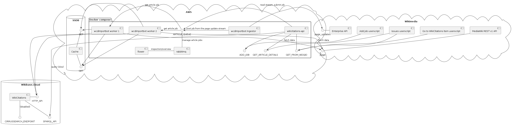
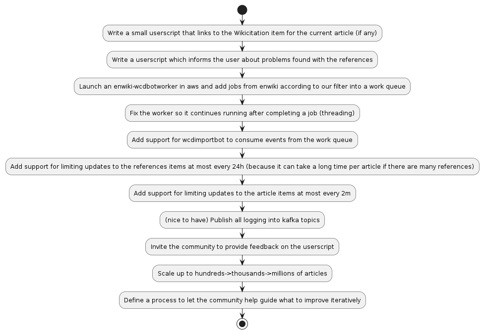

# [wcdimportbot](https://www.wikidata.org/wiki/Q115252313) ([graph](https://w.wiki/5$yU))
This ETL-framework is capable of fetching, extracting, transforming and storing 
reference information from Wikipedia articles as [structured data](https://www.wikidata.org/wiki/Q26813700) 
in a [Wikibase.cloud](https://wikibase.cloud/) instance. 
We call the resulting database Wikipedia Citations Database (WCD).

The framework has been developed by [James Hare](https://www.wikidata.org/wiki/Q23041486) 
and [Dennis Priskorn](https://www.wikidata.org/wiki/Q111016131) as part of the 
[Turn All References Blue project](https://www.wikidata.org/wiki/Q115136754) which is led by 
Mark Graham, head of The 
[Wayback Machine](https://www.wikidata.org/wiki/Q648266) department of the 
[Internet Archive](https://www.wikidata.org/wiki/Q461).

There is [at least 200 million references in at least 40 million articles](
https://ieeexplore.ieee.org/abstract/document/9908858) 
and together with the article text in the Wikipedias 
one of the most valuable collections of knowledge ever made by humans, 
see [size comparison](https://en.wikipedia.org/wiki/Wikipedia:Size_comparisons).

The endpoint providing a detailed analysis of a Wikipedia article and its references 
enable wikipedians to get an overview of the state of the references and 
build tools that help curate and improve the references. 

A Wikibase with millions of references and edges between 
them and the Wikipedia article(s) they are used on is useful
 for both Wikimedians, digital librarians and researchers who wish to understand
 which websites are linked to which pages and used as references.

This is part of a wider initiative help raise the quality of references in 
Wikipedia to enable everyone in the world to make
 decisions based on trustworthy knowledge that is derived from 
trustworthy sources.

# What is Wikibase?
Wikibase is a FLOSS graph database which enables users to store large
amounts of information and query them using [SPARQL](https://en.wikibooks.org/wiki/SPARQL).
Wikibase has been created by [Wikimedia Deutchland](https://www.wikimedia.de/) and is 
maintained by them as of this writing.

# Why store the data about references in a graph database?
The advantages of having access to this data in a graph are many.
* [Globally unique and persistent identifiers](https://www.wikidata.org/wiki/Q115493815) (aka. GUPRI) 
for as many references in Wikipedia as possible.
* Helping Wikipedians to improve the references, so they can be uniquely identified and can be 
[_turned blue_](https://www.wikidata.org/wiki/Q115136754)
([video](https://commons.wikimedia.org/wiki/File:Let%E2%80%99s_Turn_all_the_References_Blue.webm))
* Overview and visualization of references across Wikipedia articles and language editions becomes possible.
* Overview of most cited websites in the world (see also [bestref.net](https://bestref.net/) 
which is based on data extraction from the dump files)
* Insight into how many references have URLs, authors and other valuable information.
* Using SPARQL it becomes trivial for anyone to e.g. pinpoint pages with less trustworthy sources
* Using the data over time can help follow and understand changes in patterns of referencing.
* and more...

# Use cases
1. To support various queries of various citation types to learn various things about cited material.  
E.g. number of citations per source or publication.
2. To be able to query to learn about how well citations are linked... to help us understand the gaps, 
scale and scope of the Goal of Turn All References Blue.

# Estimated size
200+ million reference items (add source to research extracting references from Wikipedias). 
100+ million website items (guesstimate). 
[60 million wikipedia article](
https://en.wikipedia.org/wiki/Wikipedia:Size_of_Wikipedia#Comparisons_with_other_Wikipedias) 
items. In total ~260 million items. For comparison 
[Wikidata as of this writing have 100 million items](
https://grafana.wikimedia.org/d/000000489/wikidata-query-service?orgId=1&refresh=1m).

In total, we estimate we will have 15 triples per item which equals 15 bn triples in total. 
For comparison, 
[Wikidata as of this writing have 14.4 bn triples](
https://grafana.wikimedia.org/d/000000489/wikidata-query-service?orgId=1&refresh=1m).

# Supported templates
There are a lot of templates in use in the different Wikipedias. For now 
the bot only supports templates and parameters from English Wikipedia 
but intention is to code it in a way that avoids hardcoding of 
enwp specific templates and parameters.

## English Wikipedia templates
English Wikipedia has hundreds of special reference templates in use 
and a handful of widely used generic templates.

Currently, the focus is on supporting the most widely used reference 
templates in English Wikipedia.

### List of currently supported templates
See [config_sample.py](config_sample.py) for a list of templates.

# Terminology
We use the following terminology to distinguish different types of references.
## Templates
1) **Citation template** - see https://en.wikipedia.org/wiki/Template:Citation
2) **Citation Style 1 template** aka cs1 template - class of templates which multiple Wikipedias use. 
Implemented in lua. See https://en.wikipedia.org/wiki/Help:Citation_Style_1
3) **General reference with a supported template** - reference outside of <ref>. 
E.g. part of further reading- or bibliography section that uses a template we support.
4) **Unbulleted list citebundle template** - template with multiple templates inside, 
see https://en.wikipedia.org/wiki/Template:Unbulleted_list_citebundle
5) **bare url template** - template added in English Wikipedia (by a bot presumably) 
when a bare url is found. See https://en.wikipedia.org/wiki/Template:Cleanup_bare_URLs
 
## Reference types detected by the ArticleAnalyzer
We support detecting the following types. A reference cannot have multiple types. 
We distinguish between two main types of references:
1)  **named reference** - type of reference with only a name and no content e.g. '<ref name="INE"/>' (Unsupported 
beyond counting because we have not decided if they contain any value)
2) **content reference** - reference with any type of content 
   1) **general reference** - subtype of content reference which is outside a <ref></ref> and usually found in 
   sections called "Further reading" or "Bibliography"
   (unsupported but we want to support it, see 
   https://github.com/internetarchive/wcdimportbot/labels/general%20reference)
    
   2) **citation reference** - subtype of content reference which is inside a <ref> (supported partially, see below)

Example of a supported reference:
`<ref>Muller Report, p12 {{url|http://example.com}} {{bare url inline}}</ref>`
This is a content reference -> a citation reference -> a mixed reference with a URL template. 

Example of an unsupported reference:
`<ref>Muller Report, p12</ref>`
This is a content reference -> citation reference -> Short citation reference. 

### Citation reference subtypes with parse support 
1) **mixed reference with an ISBN template** - reference with plain text and a {{isbn}} template
2) **mixed reference with a URL template** - reference with plain text and a URL (these are very rare)
3) **ISBN template reference** - reference with only a {{isbn}} template
4) **URL template reference** - reference with only a {{url}} template
5) **Plain text reference with a cs1 template** - reference as above but where part of the 
information is structured and part of it is not (theoretical so far, we presume it exists) 
(defined as: begins with {{ and ends with }})
6) **multiple template reference with Google books template** - 
(defined as: contains multiple templates according to mwparserfromhell) 
E.g. {{cite book|url={{google books|123456}}}} <- this particular subtype we want to support
7) **multiple template reference with url and bare url x template** - 
E.g. `<ref>Muller Report, p12 {{url|http://example.com}} {{bare url inline}}</ref>`

### Citation reference subtypes without parse support
These are unsupported because of complexity
1) **reference with a Bare URL template** - as above, but with one of the {{bare url x}} templates 
2) **Plain text reference with a URL outside a template** - as above, but with no other identifier than the URL
3) **Short citation reference** aka plain text reference without a URL or identifier - 
special type of plain text reference. e.g. reference to a book only by author and title. e.g. "Muller Report, p12". 
See https://en.wikipedia.org/w/index.php?title=Wikipedia:CITETYPE

4) ([TODO](https://github.com/internetarchive/wcdimportbot/issues/471)) 
**General reference with a template** - reference outside of <ref>. 
E.g. part of further reading- or bibliography section that uses a template
5) **multiple template reference** - (defined as: contains multiple templates according to mwparserfromhell)

These two are similar but appear in different contexts. Both require a trained machine learning model to recognize 
what they are referring to.
1) **General reference without a template** - reference outside of <ref>. 
E.g. part of further reading- or bibliography section. 
2**Plain text reference without a template**: references inside <ref> tags, but without ANY template. 

These are unsupported because they are very few (<200 transclusions in enwiki)
* **Bundled reference** - multiple references in one <ref> see 
https://en.wikipedia.org/w/index.php?title=Wikipedia:CITEBUNDLE
* **Unbulleted list citebundle reference** - type of nested reference with multiple templates inside, 
see https://en.wikipedia.org/wiki/Template:Unbulleted_list_citebundle

## Types used in the graph
1) **wikipedia citation** - anything inside <ref> tags in a Wikipedia article that _can_ be 
uniquely identified via a URL, PMID, ISBN, DOI or similar identifier. 
We have a property for this in the graph and these citations get their own item with an id.
2) **wikipedia string citation** -  anything inside <ref> tags in a Wikipedia article 
that _cannot_ be uniquely identified via a URL, PMID, ISBN, DOI or similar identifier. 
These should be improved by Wikipedia editors, so they can be uniquely identified. 
E.g. lookup ISBN for a {{cite book}} or add a DOI, URL or other identifier to a {{cite journal}}
 
# Features
Currently, the framework has the following features:
* support for English Wikipedia only
* generation of a Wikibase graph based on a Wikipedia dump and upload it to Wikibase 
* API endpoint which helps jump from an article to the item in the Wikibase
* API endpoint which analyze a given article and returns statistics about it (number of references, 
number of citation templates of different types, number of references outside <ref>s, etc.)

# Diagrams

## Components

## Roadmap

## Article import sequence

# History
* version 1.0.0 a proof of concept import tool based on WikidataIntegrator (by James Hare)
* version 2.0.0+ a scalable ETL-framework with an API and capability of reading EventStreams (by Dennis Priskorn)
* version 3.0.0+ is planned to include graph generation from Wikipedia 
dumps and a get_statistic API endpoint that returns statistics 
about an article and its references. (by Dennis Priskorn)

# License
This project is licensed under GPLv3+. Copyright Dennis Priskorn 2022
The diagram PNG files are CC0.

# Further reading and installation/setup
See the [development notes](DEVELOPMENT_NOTES.md)
