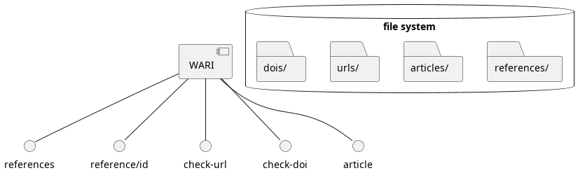
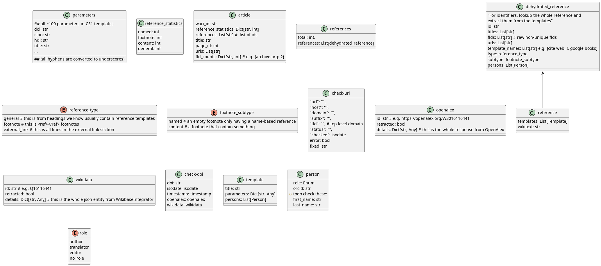

# Wikipedia Article Reference Inventory [WARI](https://www.wikidata.org/wiki/Q117023013)
This tool is capable of fetching, extracting, transforming and storing 
reference information from Wikipedia articles as [structured data](https://www.wikidata.org/wiki/Q26813700). 

WARI is currently an API with a few endpoints which hopefully makes it easy for others
to interact with.

On the longer term we are planning on populating a [Wikibase.cloud](https://wikibase.cloud/) instance 
based on the data we extract. 
We call this resulting database Wikipedia Citations Database (WCD).

WARI has been developed by [James Hare](https://www.wikidata.org/wiki/Q23041486) 
and [Dennis Priskorn](https://www.wikidata.org/wiki/Q111016131) as part of the 
[Turn All References Blue project](https://www.wikidata.org/wiki/Q115136754) which is led by 
Mark Graham, head of The 
[Wayback Machine](https://www.wikidata.org/wiki/Q648266) department of the 
[Internet Archive](https://www.wikidata.org/wiki/Q461).

There are [at least 200 million references in at least 40 million articles](
https://ieeexplore.ieee.org/abstract/document/9908858) 
and together with the article text in the Wikipedias 
one of the most valuable collections of knowledge ever made by humans, 
see [size comparison](https://en.wikipedia.org/wiki/Wikipedia:Size_comparisons).

The endpoint providing a detailed analysis of a Wikipedia article and its references 
enable wikipedians to get an overview of the state of the references and 
build tools that help curate and improve the references. 

This is part of a wider initiative help raise the quality of references in 
Wikipedia to enable everyone in the world to make decisions 
based on trustworthy knowledge 
that is derived from trustworthy sources.

# Features
WARI features a number of endpoints that help patrons 
get structured data about references in a Wikipedia article:
* an _article_ endpoint which analyzes a given article and returns basic statistics about it 
* a _references_ endpoint which gives back all ids of references found
* a _reference_ endpoint which gives back all details about a reference including templates and wikitext
* a _check-url_ endpoint which looks up the URL and gives back 
standardized information about its status
* a _check-doi_ endpoint which looks up the DOI and gives back 
standardized information about it from [FatCat](https://fatcat.wiki/), OpenAlex and Wikidata 
including abstract, retracted status, and more.

# Limitations
* the general references parsing relies on 2 things: 
  * a manually supplied list of sections to search
  * that every line with a general reference begins with a star character (*)

# Supported Wikipedias
Currently we support a handful of the 200+ language versions of Wikipedia 
but we plan on extending the support to all Wikipedia language versions 
and you can help us by submitting sections to search for references in issues and 
pull requests.

We also would like to support non-Wikimedia wikis using MediaWiki in the future 
and perhaps also any webpage on the internet with outlinks (e.g. news articles).

## Wikipedia templates
English Wikipedia for example has hundreds of special reference templates in use 
and a handful of widely used generic templates. 
WARI exposes them all when found in a reference.

## Reference types detected by the ArticleAnalyzer
We support detecting the following types. A reference cannot have multiple types. 
We distinguish between two main types of references:
1)  **named reference** - type of reference with only a name and no content e.g. '<ref name="INE"/>' (Unsupported 
beyond counting because we have not decided if they contain any value)
2) **content reference** - reference with any type of content 
   1) **general reference** - subtype of content reference which is outside a <ref></ref> and usually found in 
   sections called "Further reading" or "Bibliography"
   (unsupported but we want to support it, see 
   https://github.com/internetarchive/wcdimportbot/labels/general%20reference)
    
   2) **footnote reference** - subtype of content reference which is inside a <ref> (supported partially, see below)

Example of a URL-template reference:
`<ref>Mueller Report, p12 {{url|http://example.com}} {{bare url inline}}</ref>`
This is a content reference -> a footnote reference -> a mixed reference with a URL template. 

Example of an plain text reference:
`<ref>Muller Report, p12</ref>`
This is a footnote reference -> content reference -> Short citation reference aka naked named footnote. 

### Footnote reference subtypes we have identified in the wild
1) **mixed reference with an ISBN template** - reference with plain text and a {{isbn}} template
2) **mixed reference with a URL template** - reference with plain text and a URL (these are very rare)
3) **ISBN template reference** - reference with only a {{isbn}} template
4) **URL template reference** - reference with only a {{url}} template
5) **Plain text reference with a cs1 template** - reference as above but where part of the 
information is structured and part of it is not (theoretical so far, we presume it exists) 
(defined as: begins with {{ and ends with }})
6) **multiple template reference with Google books template** - 
(defined as: contains multiple templates according to mwparserfromhell) 
E.g. {{cite book|url={{google books|123456}}}} <- this particular subtype we want to support
7) **multiple template reference with url and bare url x template** - 
E.g. `<ref>Muller Report, p12 {{url|http://example.com}} {{bare url inline}}</ref>`
8) **reference with a Bare URL template** - as above, but with one of the {{bare url x}} templates 
9) **Plain text reference with a URL outside a template** - as above, but with no other identifier than the URL
10) **Short citation reference** aka plain text reference without a URL or identifier - 
special type of plain text reference. e.g. reference to a book only by author and title. e.g. "Muller Report, p12". 
See https://en.wikipedia.org/w/index.php?title=Wikipedia:CITETYPE

11) **General reference with a template** - reference outside of <ref>. 
E.g. part of further reading- or bibliography section that uses a template
12) **multiple template reference** - (defined as: contains multiple templates according to mwparserfromhell)

These two are similar but appear in different contexts. Both require a trained machine learning model to recognize 
what they are referring to.
1) **General reference without a template** - reference outside of <ref>. 
E.g. part of further reading- or bibliography section. 
2) **Plain text reference without a template**: references inside <ref> tags, but without ANY template. 

These bundled references are rare (<200 transclusions in enwiki)
* **Bundled reference** - multiple references in one <ref> see 
https://en.wikipedia.org/w/index.php?title=Wikipedia:CITEBUNDLE
* **Unbulleted list citebundle reference** - type of nested reference with multiple templates inside, 
see https://en.wikipedia.org/wiki/Template:Unbulleted_list_citebundle

# Diagrams
## WARI
### Components

### Classes

# History of this repo
* version 1.0.0 a proof of concept import tool based on WikidataIntegrator (by James Hare)
* version 2.0.0+ a scalable ETL-framework with an API and capability of reading EventStreams (by Dennis Priskorn)
* version 3.0.0+ WARI, a host of API endpoints that returns statistics 
about a Wikipedia article and its references. (by Dennis Priskorn)

# License
This project is licensed under GPLv3+. Copyright Dennis Priskorn 2022
The diagram PNG files are CC0.

# Further reading and installation/setup
See the [development notes](DEVELOPMENT_NOTES.md)
