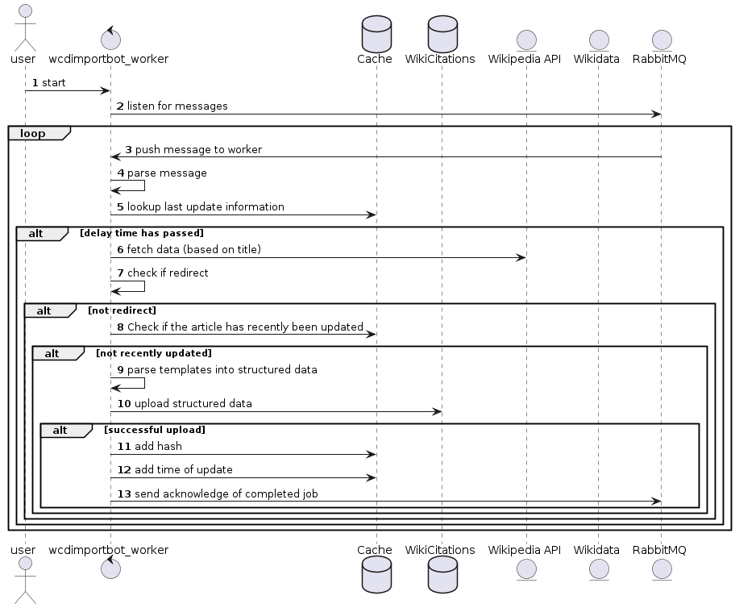

# [WikiCitations ETL-framework](https://www.wikidata.org/wiki/Q115252313) ([graph](https://w.wiki/5$yU))
This framework is capable of fetching, extracting, transforming and storing 
reference information from Wikipedia articles as [structured data](https://www.wikidata.org/wiki/Q26813700) 
in a [Wikibase.cloud](https://wikibase.cloud/) instance. 

It has been developed by [James Hare](https://www.wikidata.org/wiki/Q23041486) (version 1.0.0) 
and [Dennis Priskorn](https://www.wikidata.org/wiki/Q111016131) (version 2) as part of the 
[Turn All References Blue project](https://www.wikidata.org/wiki/Q115136754) which is led by 
Mark Graham, head of The 
[Wayback Machine](https://www.wikidata.org/wiki/Q648266) department of the [Internet Archive](https://www.wikidata.org/wiki/Q461).

A Wikibase with millions of references and edges between 
them and the Wikipedia article(s) they are used on is useful
 for both Wikimedians and researchers who wish to understand
 which websites are linked to which pages and used as references.

This is part of a wider initiative help raise the quality of sources in 
Wikipedia to enable everyone in the world to make
 decisions based on trustworthy information that is sourced by 
trustworthy sources.

# What is Wikibase?
Wikibase is a FLOSS graph database which enables users to store large
amounts of information and query them using [SPARQL](https://en.wikibooks.org/wiki/SPARQL).
Wikibase has been created by [Wikimedia Deutchland](https://www.wikimedia.de/) and is 
maintained by them as of this writing.

# Why store the data about references in a graph database?
The advantages of having access to this data in a graph are many.
* Globally unique and persistent identifiers for as many references in Wikipedia as possible. (see F1 in the [FAIR data principles](https://www.wikidata.org/wiki/Q29032644))
* Overview and visualization of references across Wikipedia articles and language editions becomes possible.
* Overview of most cited websites in the world (see also [bestref.net](https://bestref.net/) 
which is based on data extraction from the dump files)
* Insight into how many references have URLs, authors and other valuable information.
* Using SPARQL it becomes trivial for anyone to e.g. pinpoint pages with less trustworthy sources
* Using the data over time can help follow and understand changes in patterns of referencing.
* and more...

# Use cases
1. to support various queries of various citation types to learn various things about cited material.  E.g. number of citations per source or publication.
2. to be able to query to learn about how well citations are linked... to help us understand the gaps, scale and scope of the Goal of Turn All References Blue.

# Estimated size
200+ million reference items(add source to research extracting references from Wikipedias). 100+ million website items(guesstimate). [60 million wikipedia article](https://en.wikipedia.org/wiki/Wikipedia:Size_of_Wikipedia#Comparisons_with_other_Wikipedias) items. 

In total we estimate we will have 15 triples per item which equals 15 bn triples in total. For comparison, [Wikidata today has 14.4 bn triples](https://grafana.wikimedia.org/d/000000489/wikidata-query-service?orgId=1&refresh=1m).

# Supported templates
There are a lot of templates in use in the different Wikipedias. For now 
the bot only supports templates and parameters from English Wikipedia 
but intention is to code it in a way that avoids hardcoding of 
enwp specific templates and parameters.

## English Wikipedia templates
English Wikipedia has hundreds of special reference templates in use 
and a handful of widely used generic templates.

Currently the focus is on supporting the most widely used reference 
templates in English Wikipedia.

### List of currently supported templates
```
supported_templates = [
    "citation",  # see https://en.wikipedia.org/wiki/Template:Citation
    "cite q",
    "citeq",
    "isbn",
    "url",
    # CS1 templates:
    "cite arxiv",
    "cite av media notes",
    "cite av media",
    "cite biorxiv",
    "cite book",
    "cite cite seerx",
    "cite conference",
    "cite encyclopedia",
    "cite episode",
    "cite interview",
    "cite journal",
    "cite magazine",
    "cite mailing list" "cite map",
    "cite news",
    "cite newsgroup",
    "cite podcast",
    "cite press release",
    "cite report",
    "cite serial",
    "cite sign",
    "cite speech",
    "cite ssrn",
    "cite techreport",
    "cite thesis",
    "cite web",
]
```
# Terminology
We use the following terminology:
* citation: this is what is called a reference in Wikipedia and could be uniquely 
identified by one of the supported identifiers (ie DOI, ISBN, PMID, OCLC, URL)
* string citation: this is a reference that could not be uniquely identified.

# Running the bot in AWS
Because of security limitations of SSDB it is recommended 
to only run the bot on the same server as the SSDB instance.

Log into the AWS server via putty or a virtual terminal in Linux/Mac OSX. 
You will need to generate a public SSH key and have 
an account set up before being able to log in. 

Start GNU screen (if you want to have a persisting session)
`$ screen -D -RR`

Now you are ready to install and setup the bot.
The bot requires to be run on Python 3.8 or later.

# Installation
Clone the git repo:

`$ git clone https://github.com/internetarchive/wcdimportbot.git`
`$ cd wcdimportbot`

# Setup
Create a [virtual environment](https://docs.python.org/3/library/venv.html):
`$ python3 -m venv .venv`

Activate the virtual environment:
`$ source .venv/bin/activate`
- When you have finished using wcdimportbot, you can deactivate this virtual environment by typing `deactivate`

Install the dependencies:
`$ pip install -r requirements.txt`

[Generate a botpassword](https://wikicitations.wiki.opencura.com/w/index.php?title=Special:UserLogin&returnto=Special%3ABotPasswords&returntoquery=&force=BotPasswords)

Copy config.py.sample -> config.py 
`$ cp config.py.sample config.py`
and 
enter your botpassword credentials. E.g. user: "test" and password: "q62noap7251t8o3nwgqov0c0h8gvqt20"
`$ nano config.py`

If you want to delete items from the Wikibase, ask an administrator of the Wikibase to become admin.

# Features
Currently the bot can be used to import pages one by one and to rinse the imported items from the Wikibase.

## Import one or more pages
The bot can import any Wikipedia article (in English Wikipedia)

`$ python wcdimportbot.py --import "title of article"` 

## Import range
The bot can import ranges of Wikipedia articles (in English Wikipedia) in the order A-Z

`$ python wcdimportbot.py --max-range 10` 

## Import range based on category
The bot can import ranges of Wikipedia articles (in English Wikipedia)

`$ python wcdimportbot.py --category "title of category"` 

# Help
Run `$ python wcdimportbot.py --help` to see a list of all supported commands

# Diagrams

## Components


## Roadmap


## Ingestor sequence


## Worker sequence



## License
This project is licensed under GPLv3+. Copyright Dennis Priskorn 2022
The diagram PNG files are CC0.
